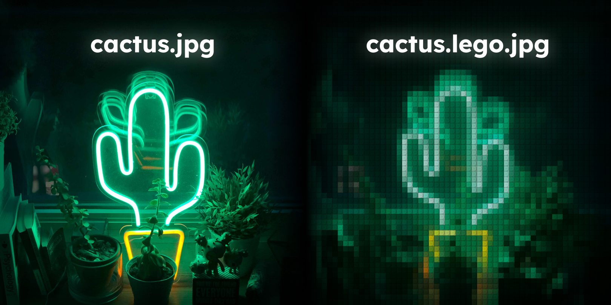

# ToLego
A simplistic cli tool that transforms your pictures into lego brick pictures made with rust using the [image](https://crates.io/crates/image) lib.

# Steps

1. computes the average color of the brick by passing through each pixels of the brick;

2. multiplies by the brick pixel (allows to tend to black when the brick pixel tends to black otherwise it keeps the average color).

3. saves the image to path/to/file.lego for optimization

4. optimizes the lego file and saves to path/to/file.lego.png using [oxipng](https://github.com/shssoichiro/oxipng)

# Usage

the brick.jpg need to be in the same directory as the executable

- `ToLego.exe -f path/to/picture` -> default bricksize (50px / 50px)
- `ToLego.exe -f path/to/picture -b 100` -> bricksize of 100px / 100px

# Setup

## Install

`cargo install`

## Build

`cargo build --target-dir dist`

## Debug

`cargo run -- -f path/to/file -b 25`